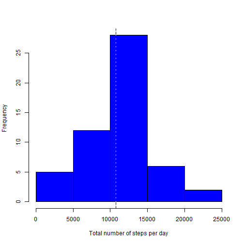
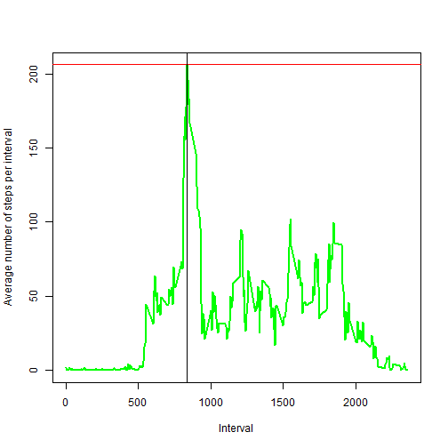
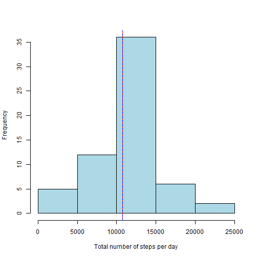

# Reproducible Research: Peer Assessment 1    
=======================================================
8/17/2014      
Swift-AAM

- - -
### Loading and preprocessing the data

```r
Data <- read.csv("E:\\activity.csv", header=T)
```

```r
library(xtable)
```

```
## Error: there is no package called 'xtable'
```

```r
#Set the output options for numbers
options(scipen = 9, digits = 3 )
print(xtable(summary(Data)), type="html")
```

```
## Error: could not find function "xtable"
```
- - -
### What is mean total number of steps taken per day?

```r
library(plyr)
```

```
## Warning: package 'plyr' was built under R version 3.0.3
```

```r
spd <- ddply(Data, .(date), summarize, steps = sum(steps))
mean.spd <- mean(spd$steps, na.rm = TRUE)
median.spd <- median(spd$steps, na.rm = TRUE)
```
The mean total number of steps per day is 10766.189 and the median is 10765.
- - -
**Histogram of the total number of steps taken each day**

```r
hist(spd$steps, xlab="Total number of steps per day", main=NULL, col="blue")
abline(v=mean.spd, col = c("gray"))
abline(v=median.spd, col = c("black"), lty = 2)
```

 
- - -
### What is the average daily activity pattern?

```r
spi <- ddply(Data, .(interval), summarize, steps = mean(steps, na.rm=TRUE))
max.spi <- max(spi$steps)
max.int <- spi[spi$steps==max(max.spi),1]
```
**Plot of the average number of steps taken each interval**

```r
plot(spi$interval,spi$steps, ylab="Average number of steps per interval",xlab="Interval", main=NULL, type="l", lwd=2, col="green")
abline(h=max.spi, col = c("red"))
abline(v=max.int, col = c("black"))
```

 
The maximum number of steps per interval in average is 206.17 and corresponds to the interval 835.
- - -
### Imputing missing values

```r
miss <- dim(Data[is.na(Data$steps),])[1]
```
There are 2304 rows with missing values.

```r
#Copy of Data
Data1 <- Data
#Filling na values with total steps means (Not good enough)
# replace(Data1$steps, is.na(Data1$steps), mean(Data1$steps, na.rm=T))
#Filling na values with interval's steps means (Much better)
row.names(spi)<- spi$interval
ind <- which(is.na(Data1$steps))
Data1[ind,1] <- spi[as.factor(Data1[ind,3]),2]
detach(Data)
```

```
## Error: invalid 'name' argument
```

```r
attach(Data1)
```
- - -
### What is the new mean total number of steps taken per day?

```r
spd1 <- ddply(Data1, .(date), summarize, steps = sum(steps))
mean.spd1 <- mean(spd1$steps, na.rm = TRUE)
median.spd1 <- median(spd1$steps, na.rm = TRUE)
```
The *new* mean total number of steps per day is 10766.189 and the *new* median is 10766.189.

```r
mdays <- dim(spd[is.na(spd$steps),])[1]
mdays1 <- dim(spd1[is.na(spd1$steps),])[1]
```
*Do these values differ from the estimates from the first part of the assignment?*
The mean of the first part is 10766.189 as well as the mean of the second part (10766.189). The median of the fist part is 10765 is different from the median of the second part: 10766.189.
*What is the impact of imputing missing data on the estimates of the total daily number of steps?*
The first total daily number of steps estimation had 8 missing values, while the second one has 0 missing values.

```r
t1 <- merge(spd,spd1, by=1)
names(t1)<- c("Date","First estimate","Second estimate")
print(xtable(t1), type="html")
```

```
## Error: could not find function "xtable"
```
- - -
**Histogram of the new total number of steps taken each day**

```r
hist(spd1$steps, xlab="Total number of steps per day", main=NULL, col="light blue")
abline(v=mean.spd1, col = c("red"))
abline(v=median.spd1, col = c("blue"), lty = 2)
```

 
- - -
### Are there differences in activity patterns between weekdays and weekends?

```r
Data1$day <- weekdays(as.Date(date))
attach(Data1)
```

```
## The following objects are masked from Data1 (position 3):
## 
##     date, interval, steps
```

```r
d <- levels(factor(day))
Data1$week <- "weekday"
Data1[day==d[1],5]<-"weekend"
Data1[day==d[6],5]<-"weekend"
Data1$week <- as.factor(Data1$week)
spiw <- ddply(Data1, .(interval,week), summarize, steps = mean(steps, na.rm=TRUE))
max.spiw <- max(spiw$steps)
max.intw <- spiw[spiw$steps==max(max.spiw),1]
```
**Plot of the average number of steps taken each interval during weekends and weekdays**

```r
library(ggplot2)
```

```
## Error: there is no package called 'ggplot2'
```

```r
ggplot(data=spiw, aes(x=interval, y=steps, group=week)) + geom_line(aes(color=week))+ facet_wrap(~ week, nrow=2)
```

```
## Error: could not find function "ggplot"
```
